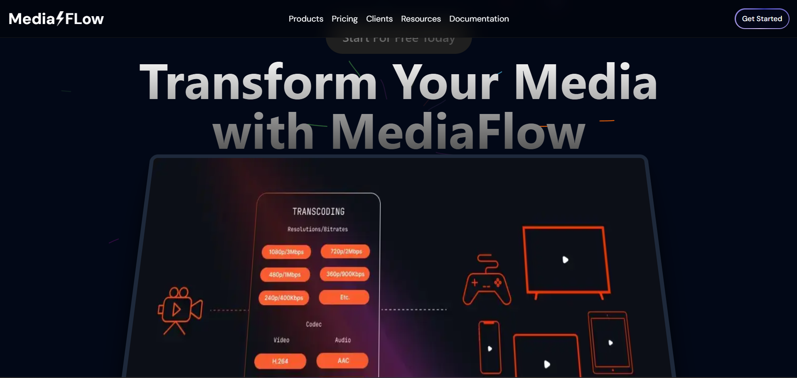
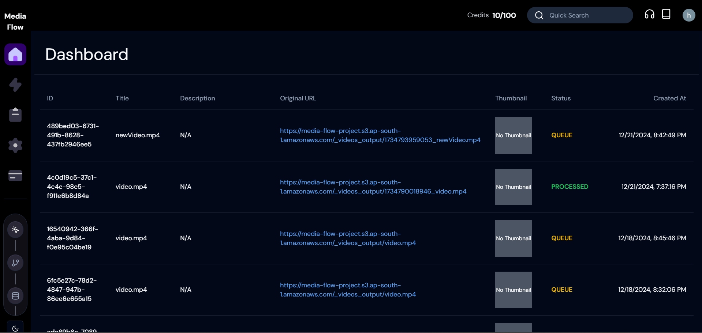
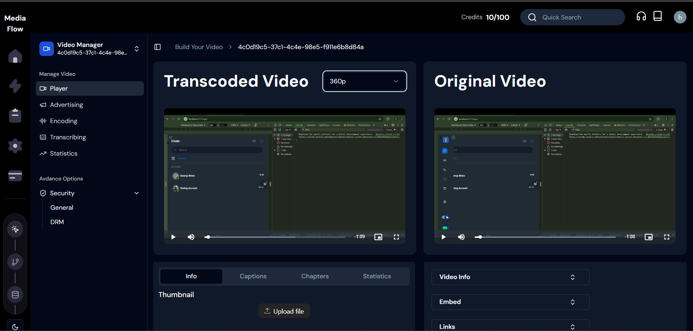
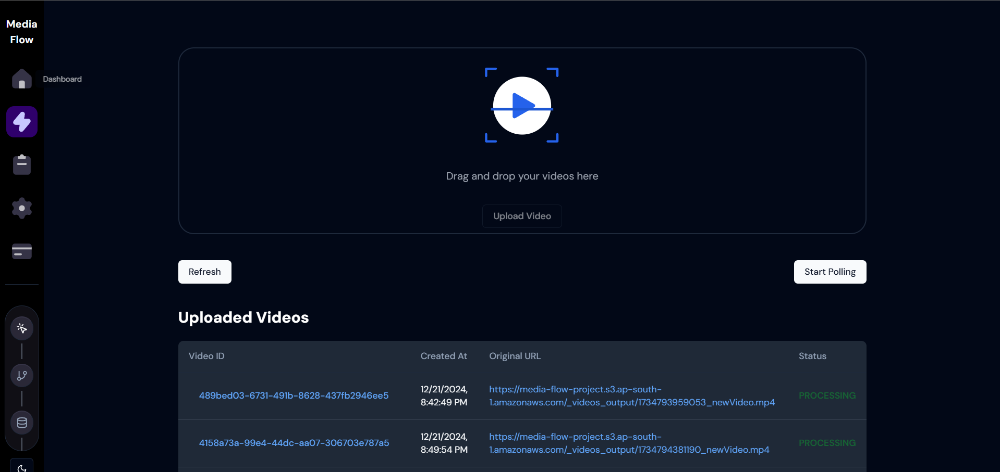
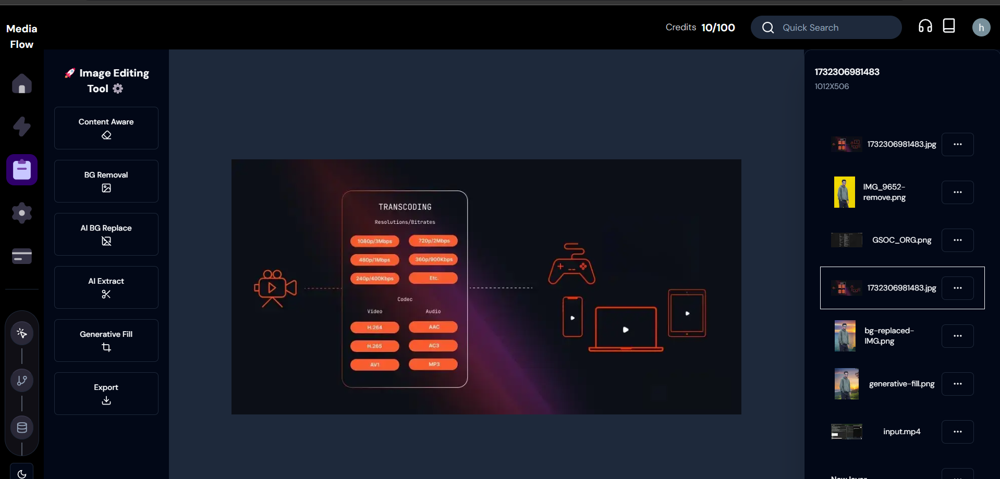
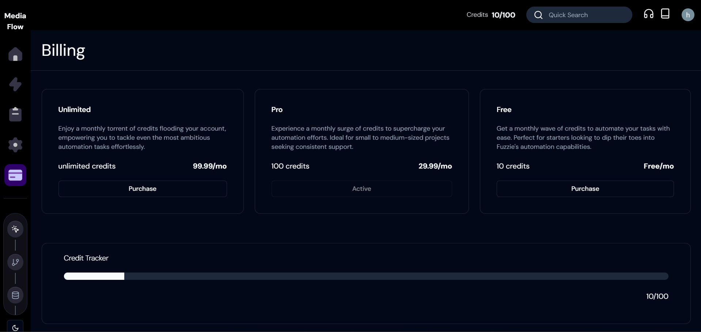

# MediaFlow: Video Transcoder & AI Image/Video Editor 🚀

Welcome to **MediaFlow**, an all-in-one platform designed to simplify and automate video transcoding, image/video editing, and more! This powerful tool allows you to transcode videos into multiple formats, edit images and videos using AI-powered features, and integrate cloud-based storage seamlessly. Whether you're a content creator, marketer, or developer, **MediaFlow** can help you streamline your workflow.

## Features 🎬

### 1. **Seamless Video Transcoding** 🔄

Effortlessly transcode videos into multiple formats, including HSL, and store them directly to **AWS S3**. No more worries about different video formats or compatibility issues.

### 2. **AI-Powered Video/Image Editing** 🖼️

- **Background Removal**: Remove unwanted backgrounds from images or videos with just a click.
- **Background Replacement**: Replace the background of your videos with an AI-generated backdrop, making it easy to produce high-quality content.
- **Smart Video Cropper**: Automatically crop videos based on important content areas to save time and effort.
- **Caption Generator**: Auto-generate captions for your videos to enhance accessibility and engagement.

### 3. **Cloud Integration** ☁️

- **AWS S3** for seamless cloud storage and delivery of media files.
- Process and store large media files efficiently and scale as needed.

---

## Tech Stack 💻

### Frontend:

- ⚛️ **Next.js** – A powerful framework for React, used for server-side rendering and static site generation.
- 🎨 **Tailwind CSS** – A utility-first CSS framework for rapidly building custom designs.
- ⚙️ **Shadcn** – UI components for modern and beautiful interfaces.
- 🌟 **Aceternity UI** – A customizable UI library to enhance user experience.
- 🧩 **Zustand** – A simple state management library for React.

### Backend:

- 🐳 **AWS S3** – Cloud storage solution for saving and serving media files.
- 🧑‍💻 **Redis** – Used for fast data caching and managing job queues.
- 🧑‍💼 **BullMQ** – A powerful queue system for handling background jobs and transcoding tasks.
- 🖼️ **Cloudinary** – Used for image and video processing, including transcoding and background removal.
- 🔐 **Clerk** – Provides authentication and user management.
- 🧳 **Prisma** – ORM for easy interaction with PostgreSQL, ensuring type-safe database queries.
- 🧩 **Zod** – Used for runtime type validation to ensure data integrity.
- 📤 **Uploadcare** – Seamless file uploads for images and videos.
- 💳 **Stripe** – Integrated payment gateway for transactions.

### Database:

- 🗃️ **PostgreSQL** – A relational database for storing user data, video details, captions, and more.

### Cloud & Deployment:

- 🐳 **AWS ECR & ECS** – For managing Dockerized applications and smooth deployment.
- ⚡ **Serverless architecture** – Optimized for scalability and cost-efficiency.

---

## How It Works 🛠️

1. **Video Transcoding**:

   - Upload your video file via **Uploadcare**.
   - Select the desired output format and resolution.
   - The system processes the video in the background using **BullMQ** and **Redis**.
   - The final transcoded video is stored in **AWS S3** for fast and scalable delivery.

2. **AI Image & Video Editing**:

   - Use the built-in **Cloudinary** and **AI tools** for background removal and replacement, making edits easier and faster.
   - The **Smart Video Cropper** analyzes your video and crops it intelligently based on the most relevant parts of the video content.
   - **Caption Generation** uses speech-to-text technology to add captions automatically.

3. **Cloud Integration**:
   - All processed files are stored in **AWS S3**, ensuring they are securely stored and easily accessible.
   - The **Prisma** ORM interacts with the PostgreSQL database to store user information, video metadata, captions, and more.

---

# ScreenShots 📸

# Contributing 🤝

We welcome contributions to improve MediaFlow! Feel free to submit a pull request or open an issue if you have any suggestions, bugs, or feature requests.

# Acknowledgments 🙏

- Cloudinary for providing exceptional image/video processing capabilities.
- AWS for cloud storage solutions.
- Prisma and PostgreSQL for seamless database management.
- Stripe for easy payment processing integration

**Thank you** 💖 for checking out MediaFlow! I’m excited to see how this project will help users automate video processing, editing, and cloud storage management. 🌍
